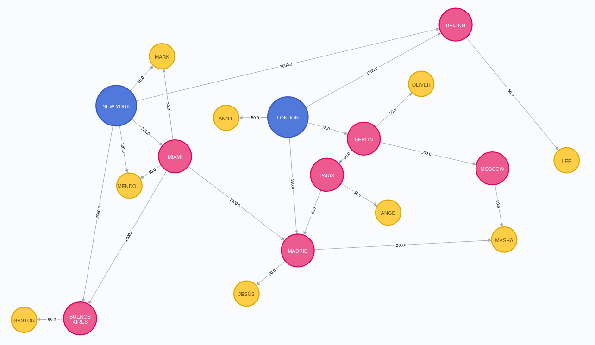
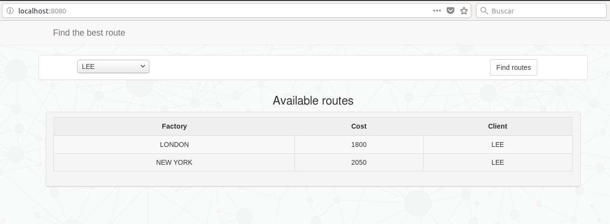
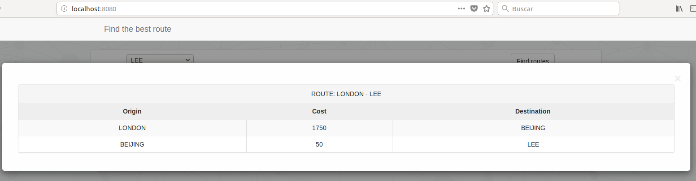

# Spring Boot and Neo4J

Spring Boot and Neo4J without using Spring Data Neo4j.

Sometimes, the implementation of Spring Data is complicated when the graph model is somewhat more complex and, sometimes, it does not have the flexibility we need with respect to nodes and relationships of those nodes.

##### Requeriments

- Neo4J (Run Neo4J with Docker: https://neo4j.com/developer/docker-run-neo4j/)
- JDK 8+


## The problem

A sunglasses company has two factories (New York and London) and it is desired to be able to send orders to a customer.

This company needs other intermediate centers, which are only responsible for storing and sending orders to other locations or to a customer.

Finally, each shipment has a delay and a cost associated with it.

What is the optimal route?





## The model

First, the graph model will be created in Neo4J given the previous image.

The elements to be represented in the graph model:

- **factory**: It is the node that represents a location that generates the order.
- **location**: It is the node that represents a intermediate location to store and send orders to the customer.
- **customer**: It is the node that represets a customer.
- **SEND**: It is an action that represents the relation between nodes.

To do this, you need to know the Cypher language that Neo4J uses.

```
// build a graph with cypher (nodes and edges)

CREATE
(`01`:factory{id:"01", name:"NEW YORK"}),
(`02`:factory{id:"02", name:"LONDON"}),
(`03`:location{id:"03", name:"BEIJING"}),
(`04`:location{id:"04", name:"MIAMI"}),
(`05`:location{id:"05", name:"BERLIN"}),
(`06`:location{id:"06", name:"MADRID"}),
(`07`:location{id:"07", name:"PARIS"}),
(`08`:location{id:"08", name:"BUENOS AIRES"}),
(`09`:location{id:"09", name:"MOSCOW"}),
(`1`:customer{id:"1", name:"MARK"}),
(`01`)-[:`SEND` {cost:25.0, origin:"NEW YORK", destination:"MARK"}]->(`1`),
(`04`)-[:`SEND` {cost:50.0, origin:"MIAMI", destination:"MARK"}]->(`1`),
(`4`:customer{id:"4", name:"MENDOZA"}),
(`01`)-[:`SEND` {cost:100.0, origin:"NEW YORK", destination:"MENDOZA"}]->(`4`),
(`04`)-[:`SEND` {cost:50.0, origin:"MIAMI", destination:"MENDOZA"}]->(`4`),
(`6`:customer{id:"6", name:"JESÚS"}),
(`06`)-[:`SEND` {cost:50.0, origin:"MADRID", destination:"JESÚS"}]->(`6`),
(`5`:customer{id:"5", name:"OLIVER"}),
(`05`)-[:`SEND` {cost:50.0, origin:"BERLIN", destination:"OLIVER"}]->(`5`),
(`7`:customer{id:"7", name:"ANGE"}),
(`07`)-[:`SEND` {cost:50.0, origin:"PARIS", destination:"ANGE"}]->(`7`),
(`9`:customer{id:"9", name:"MASHA"}),
(`09`)-[:`SEND` {cost:50.0, origin:"MOSCOW", destination:"MASHA"}]->(`9`),
(`06`)-[:`SEND` {cost:200.0, origin:"MADRID", destination:"MASHA"}]->(`9`),
(`3`:customer{id:"3", name:"LEE"}),
(`03`)-[:`SEND` {cost:50.0, origin:"BEIJING", destination:"LEE"}]->(`3`),
(`2`:customer{id:"2", name:"ANNIE"}),
(`02`)-[:`SEND` {cost:50.0, origin:"LONDON", destination:"ANNIE"}]->(`2`),
(`8`:customer{id:"8", name:"GASTÓN"}),
(`08`)-[:`SEND` {cost:50.0, origin:"BUENOS AIRES", destination:"GASTÓN"}]->(`8`),
(`01`)-[:`SEND` {cost:200.0, origin:"NEW YORK", destination:"MIAMI"}]->(`04`),
(`01`)-[:`SEND` {cost:2000.0, origin:"NEW YORK", destination:"BEIJING"}]->(`03`),
(`01`)-[:`SEND` {cost:2000.0, origin:"NEW YORK", destination:"BUENOS AIRES"}]->(`08`),
(`04`)-[:`SEND` {cost:1000.0, origin:"MIAMI", destination:"BUENOS AIRES"}]->(`08`),
(`04`)-[:`SEND` {cost:1000.0, origin:"MIAMI", destination:"MADRID"}]->(`06`),
(`02`)-[:`SEND` {cost:1750.0, origin:"LONDON", destination:"BEIJING"}]->(`03`),
(`02`)-[:`SEND` {cost:75.0, origin:"LONDON", destination:"BERLIN"}]->(`05`),
(`02`)-[:`SEND` {cost:150.0, origin:"LONDON", destination:"MADRID"}]->(`06`),
(`05`)-[:`SEND` {cost:50.0, origin:"BERLIN", destination:"PARIS"}]->(`07`),
(`05`)-[:`SEND` {cost:500.0, origin:"BERLIN", destination:"MOSCOW"}]->(`09`),
(`07`)-[:`SEND` {cost:25.0, origin:"PARIS", destination:"MADRID"}]->(`06`);
```

With this, you have the previous model in Neo4J and you could already develop a solution to interact with that graph.


## The solution

To search for all possible routes, sorted by cost to obtain the best route, in Neo4J it is only necessary to perform this CYPHER query, where the **<customer_id>** field is a ID that identify the customer.

```
MATCH p=(f:factory)-[:SEND*]->(c:customer {id:"<customer_id>"})
WITH *, relationships(p) AS routes, reduce(cost=0, route in relationships(p) | cost+route.cost) AS total
RETURN f AS factory, routes, c AS customer, total
ORDER BY total ASC
```

On this occasion, use Spring Data with Neo4J is not very useful due to the required response could have three distinct node types and other complex operations (sum cost) so the Neo4J response is more much complex than others.

Therefore, it will be used directly the Neo4J-Java driver to be able to be more flexibility and map the response more conveniently with a custom mapper to improve the integration between Neo4J and the application.

##### Neo4J-Java driver dependency

To use this driver, you just have to add the dependency in the _pom.xml_ file.

```xml
<dependency>
    <groupId>org.neo4j.driver</groupId>
    <artifactId>neo4j-java-driver-spring-boot-starter</artifactId>
    <version>4.0.0-beta02</version>
</dependency>
```

##### Neo4J-Java driver configuration

To configure the driver, you simply have to define the Neo4J server and its authentication in the application.properties file (or _*.yml_)

```yaml
org.neo4j.driver.uri=bolt://localhost:7687
org.neo4j.driver.authentication.username=neo4j
org.neo4j.driver.authentication.password=test
```

##### Neo4J-Java driver use

For use, you simply have to inject the _**driver component**_ where you want to use

```java
  private Driver neo4jDriver;
  
  @Autowired
  public RouteRepositoryDefault(Driver neo4jDriver) {
    this.neo4jDriver = neo4jDriver;
  }
```


## The case of use

Finally, to check the application and the graph model, exist a website where you can search the available routes, their cost and the paths of each route (_Neo4J_) for each of the clients (_http://localhost:8080_)




